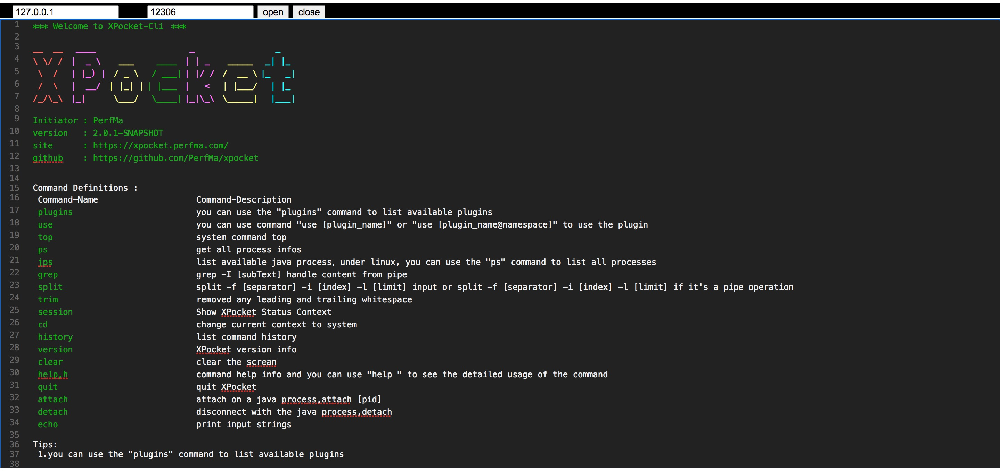

# web-telnet

#### 介绍
使用JAVA作为后台开发的一块简单的web版本telnet 命令行
使用Springboot 作为Web的后端
加入WebSocket 的推送支持
以及common-net 工具包里面对于Telnet的支持

#### 使用说明

1.  通过IDEA 或者Eclipse 等开发工具进行打开，运行Application.java main 方法
2.  本地浏览器访问： http://localhost:8080

#### 效果展示

